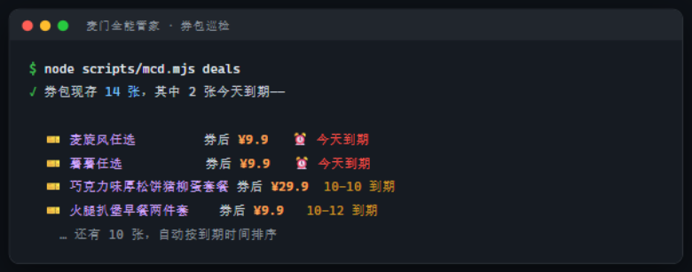
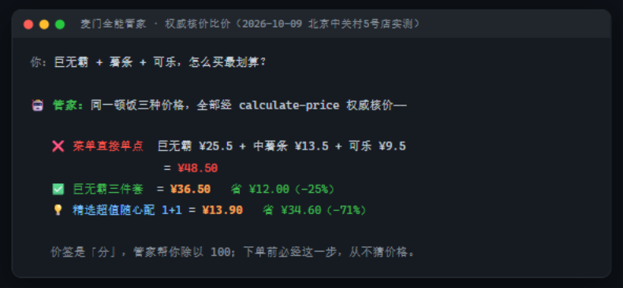
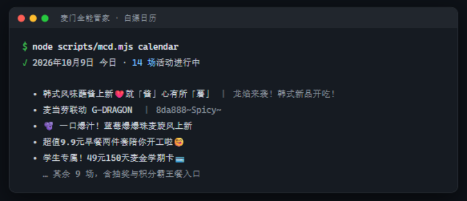
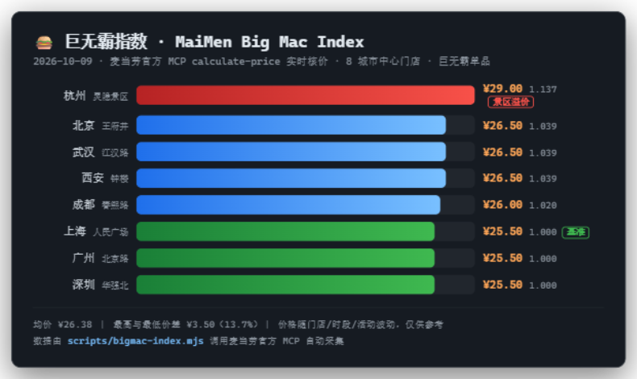
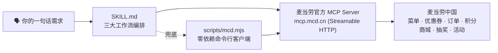

# 🍔 麦门全能管家 MaiMen Butler

> **让 AI 把你的麦当劳安排得明明白白：该领的券自动领，该薅的羊毛一天不落，点餐永远是最优价。**

   

一个基于 **麦当劳中国官方 MCP**（`https://mcp.mcd.cn`）开发的全能点餐助手 Skill，适配 ZCode / WorkBuddy 等 MCP 客户端。三合一能力：

| 能力 | 一句话 |
|---|---|
| 🛡️ **省钱助手** | 可领优惠券一键全领，点餐自动比价出最低价组合，积分快过期主动提醒兑换 |
| 🍔 **点餐助手** | 一句话点餐："来个不辣、500 大卡以内的套餐" → 推荐 → 算价 → 下单，全程对话完成 |
| 🎁 **白嫖日历** | 营销活动、每日抽奖机会、限时免费，主动弹出来提醒你去薅 |

---

## 😩 为什么做这个

每个麦门信徒都经历过：

- 🎫 优惠券躺在 App 里没领，下单时多花 8 块
- 🤔 点开菜单 200 个 SKU，纠结 20 分钟最后随便点
- 🎰 抽奖机会白白过期，积分悄悄清零
- 📱 下个 App、注册会员、翻活动页……就想吃个汉堡而已

**麦门全能管家把这些全部变成一句话的事。** 你只管说"今晚想吃点便宜的辣的"，剩下的交给 AI。

## 💬 使用示例

```text
你：今晚加班，想吃麦当劳，预算 35 以内，有没有划算的吃法？

管家：🛡️ 已为你领取 3 张可用优惠券（含"板烧鸡腿堡买一送一"）。
     综合比价后推荐：
     1️⃣ 板烧鸡腿堡买一送一 + 零度可乐    ≈ ¥27.5（省 ¥12）
     2️⃣ 麦辣鸡腿堡套餐（用 5 元券）      ≈ ¥30.0（省 ¥5）
     要下单哪个？我帮你算好送到公司。
```

```text
你：最近在减脂，中午有什么 500 大卡以内的选择？

管家：🍔 查了下营养数据，这几款达标：
     · 板烧鸡腿堡（去酱）        ≈ 320 kcal / 26g 蛋白质
     · 凯撒至尊鸡排谷麦堡（半份）  ≈ 410 kcal
     配零度可乐正好一顿减脂餐，需要我把去酱版加进常点吗？
```

```text
你：麦麦今天有什么可以白嫖的？

管家：🎁 今日可薅清单：
     · 「88 金粉节」第二份半价，今天最后一天
     · 你有 1 次免费抽奖机会 → 抽中了 2 张 5 元券
     · 积分账户 1,024 分，月底过期，商城里「中薯免费券」只要 500 分，要兑吗？
```

> 以上为交互示意，实际结果以麦当劳 MCP 实时返回为准。

## 📸 真实数据实测（非摆拍）

以下全部来自真实 MCP 调用（2026-10-09，Token 已脱敏）：

| 券包巡检 | 权威核价比价 | 白嫖日历 |
|---|---|---|
|  |  |  |

**同一顿巨无霸 + 薯条 + 可乐的三种价格**（`calculate-price` 权威核价，北京中关村5号店实测）：

> ❌ 菜单直接单点 = **¥48.50**
> ✅ 巨无霸三件套 = **¥36.50**（省 ¥12.00 / -25%）
> 💡 精选超值随心配 1+1 = **¥13.90**（省 ¥34.60 / -71%）

菜单接口不展示价格，唯一可信的报价来自 `calculate-price`——管家每一单都走权威核价，从不猜价格。

## 📊 巨无霸指数 MaiMen Big Mac Index

内置 [`scripts/bigmac-index.mjs`](scripts/bigmac-index.mjs)：一键采集全国 8 城市中心门店的巨无霸实时价格，生成麦门版巨无霸指数（致敬 The Economist）：



2026-10-09 实测：均价 ¥26.38，最贵（杭州灵隐景区 ¥29.00）与最便宜（上海/广州/深圳 ¥25.50）价差 **13.7%**——景区溢价在麦门数据里无处遁形。运行 `node scripts/bigmac-index.mjs` 即可刷新。

## 🆚 与"只读"工具的区别

市面上的麦麦工具大多只做"读"（查一查、推一条晨报）。麦门全能管家是**"读 + 做"**：领券、比价、下单、抽奖、积分兑换都能实际执行——当然，每一个花钱的写操作都强制先经你确认。

## 🎉 1024 程序员节模式

10 月 20 日-26 日自动激活（由 `now-time-info` 驱动）：热量改用程序员单位播报（**1G = 1024 kcal**）、主动推送程序员节活动与"Bug 猎杀奖励"巡检、推荐"改完最后一个 Bug 就吃"的下单理由。1024 当天上手，仪式感拉满。

## 🚀 快速开始

### 第 1 步：获取麦当劳 MCP Token（免费）

1. 打开 [open.mcd.cn/mcp](https://open.mcd.cn/mcp)，手机号验证码登录
2. 进入 **控制台** → 点击 **激活** → 同意服务协议
3. 复制你的 **MCP Token**

### 第 2 步：接入 MCP 客户端

在 ZCode / WorkBuddy / Cherry Studio / Cursor 等支持 Streamable HTTP 的客户端中配置（参考 [`mcp-config.example.json`](mcp-config.example.json)）：

```json
{
  "mcpServers": {
    "mcd": {
      "type": "streamablehttp",
      "url": "https://mcp.mcd.cn",
      "headers": { "Authorization": "Bearer <你的MCP_TOKEN>" }
    }
  }
}
```

### 第 3 步：安装本 Skill

把本仓库克隆下来，将 [`SKILL.md`](SKILL.md) 安装到你的 AI 客户端 Skill 目录（ZCode / WorkBuddy 用户可直接指向本仓库目录），然后：

```text
你：麦麦，帮我看看今天有什么优惠券
```

### 纯命令行（不想装 Agent？）

零依赖，Node ≥ 18 即可：

```bash
git clone https://github.com/07liu/maimen-butler.git
cd maimen-butler
echo "MCD_MCP_TOKEN=<你的Token>" > .env    # 或 export 环境变量

node scripts/mcd.mjs tools        # 列出全部 35 个 MCP 工具及参数
node scripts/mcd.mjs deals        # 当前可领优惠券
node scripts/mcd.mjs account      # 积分余额与临期提醒
node scripts/mcd.mjs calendar     # 营销活动日历（自动带当天日期）
node scripts/mcd.mjs call query-nearby-stores '{"beType":1,"searchType":1}'   # 调任意工具

node scripts/patrol.mjs           # 🚨 每日巡检：积分临期+可领券+今日活动+抽奖机会，一次跑完
node scripts/compare.mjs --city 北京 --keyword 中关村 \
  '[{"name":"巨无霸单点","items":[{"productCode":"1100","quantity":1}]},
    {"name":"巨无霸x2","items":[{"productCode":"1100","quantity":2}]}]'   # ⚖️ 多组合权威核价
```

> 也可以用 npm 别名：`npm run patrol` / `npm run bigmac` / `npm run deals`（零依赖，不需要 npm install）。

## 🚨 每日巡检 MaiMen Patrol

[`scripts/patrol.mjs`](scripts/patrol.mjs) 把"每天该薅的羊毛"一次跑完——积分临期、可领优惠券、今日活动、抽奖机会，实测输出（2026-10-09）：

```text
💰 积分账户：可用积分与当月临期积分实时读取，临期自动提醒兑换
🎫 可领优惠券：共 9 张（免费脆薯饼 / 麦旋风买一送一 / 9.9元冰美式 …）
🎁 今日活动：共 14 个（G-DRAGON 联名 / 9.9元早餐两件套 …）
🎰 积分抽奖：麦麦积分抽奖进行中，是否可参与以服务端决策为准
```

配 Windows 任务计划程序或 cron 就是全自动定时巡检（`node scripts/patrol.mjs --json` 可接通知管道）：

```bash
# cron 示例：每天 9:00 / 21:00 各巡检一次
0 9,21 * * *  cd /path/to/maimen-butler && node scripts/patrol.mjs >> patrol.log 2>&1
```

## ⚖️ 麦门比价器 MaiMen Compare

[`scripts/compare.mjs`](scripts/compare.mjs)：同一门店多组候选（单点 vs 套餐 vs 用券）批量走 `calculate-price` 权威核价，按券后价排序、标出最优解 👑。支持 `--store` 指定门店或 `--city + --keyword` 自动选店，外送/得来速场景可传 `--beCode`。

## 🏗️ 工作原理



- [`SKILL.md`](SKILL.md) 定义了省钱 / 点餐 / 白嫖三条工作流与安全规则（下单前必确认、永不代付）
- [`scripts/mcd.mjs`](scripts/mcd.mjs) 是一个约 250 行的零依赖 MCP Streamable HTTP 客户端（自动握手、SSE 解析、401/429 友好提示），让没有 Agent 的同学也能用
- [`scripts/patrol.mjs`](scripts/patrol.mjs) / [`scripts/compare.mjs`](scripts/compare.mjs) / [`scripts/bigmac-index.mjs`](scripts/bigmac-index.mjs) 是基于它构建的三个开箱即用工具：每日巡检、多组合比价、巨无霸指数
- 所有真实交易（支付）仍在麦当劳官方 App 完成，本管家不碰钱

## 🎯 目标用户

| 人群 | 打开方式 |
|---|---|
| 🧑‍💻 程序员 / 打工人 | 加班餐一句话搞定，预算内自动找最优解 |
| 💰 精打细算党 | 券自动领、价自动比、积分不过夜 |
| 🏃 健身减脂人群 | 热量营养数据对比，吃得明白 |
| 🧋 麦门信徒 | 活动、抽奖、限定，一个不落 |

## 🗺️ Roadmap

- [x] ~~巨无霸指数：8 城实时比价~~（已上线，见上文）
- [x] ~~1024 程序员节模式~~（日期自动激活）
- [x] ~~定时巡检~~（`patrol.mjs` 每日巡检脚本已上线，配 cron/任务计划即全自动推送）
- [ ] 巡检结果接通知管道（Server 酱 / 企业微信 webhook）
- [ ] 多人拼单分账
- [ ] 生日会 / 派对主题场景支持（`query-party-*` 已预留）

## ⚠️ 声明

本项目为 **2026 麦当劳程序员节创意开发大赛** 参赛作品，由参赛者独立开发，**非麦当劳官方产品**。餐品、价格、活动信息以麦当劳官方渠道实时数据为准。请妥善保管你的 MCP Token，不要提交到任何公开仓库。参赛声明见 [CONTEST_DECLARATION.md](CONTEST_DECLARATION.md)。

## 🙏 鸣谢

- [麦当劳中国 MCP Server](https://github.com/M-China/mcd-mcp-server) — 官方 MCP 能力与文档
- [麦当劳程序员节创意开发大赛](https://github.com/M-China/mcd-developer-innovation-challenge) — 活动官方仓库
- [open.mcd.cn](https://open.mcd.cn/mcp) — 开放平台入口

---

**麦门！** 🍔 如果这个项目帮到了你，求一个 Star ⭐ —— 你的 Star 就是我的巨无霸。
